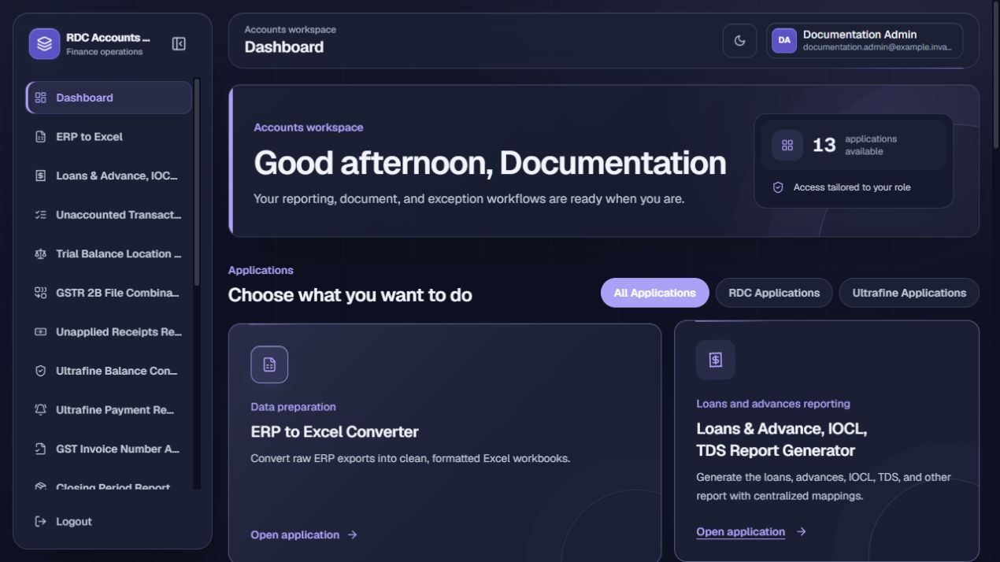
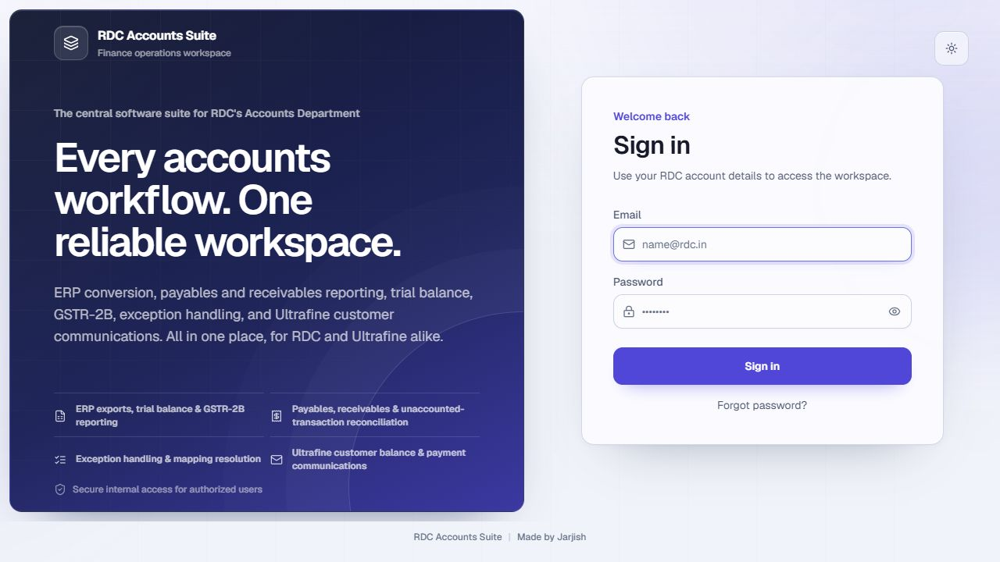
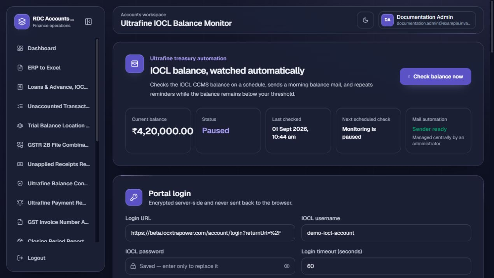
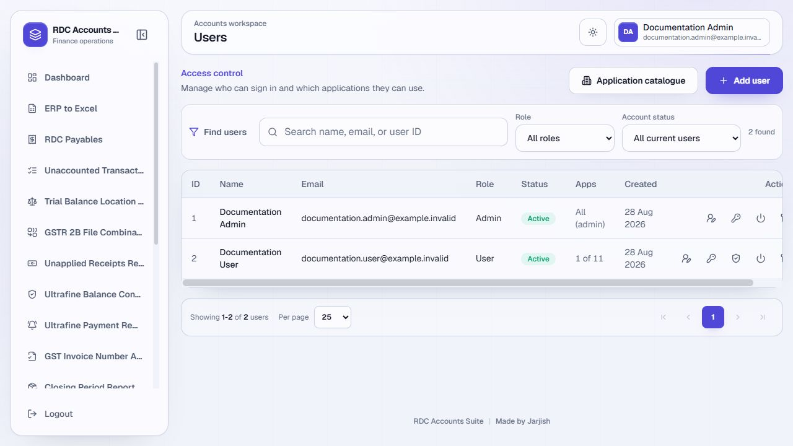
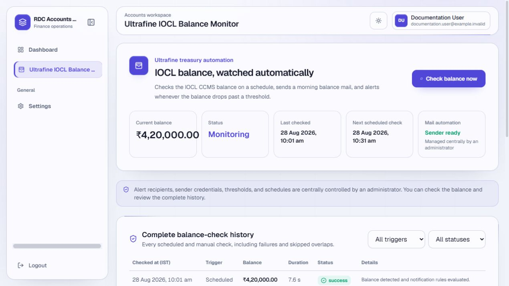
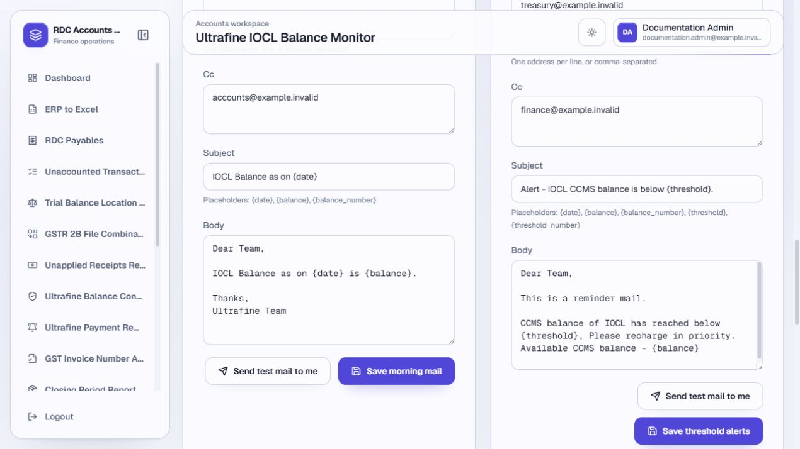
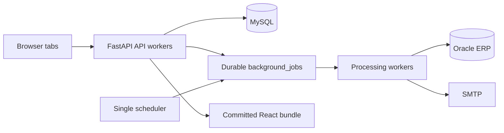

# RDC Accounts Suite

RDC Accounts Suite is the shared web workspace for RDC Concrete and Ultrafine's
Accounts teams. It brings the former Windows utilities into one readable,
role-aware application with durable background processing, central mappings,
Oracle-backed reports, and scheduled email workflows.



## What it includes

| Application | Purpose | External dependency |
| --- | --- | --- |
| ERP to Excel Converter | Clean and format ERP exports as workbooks | None |
| RDC Payables Report | Produce the mapped payables report | None |
| Unaccounted Transactions, Pending MRN & Uninvoiced Expense POs | Generate the three exception reports and mail package | None |
| Trial Balance Location Wise | Convert and review trial-balance data | None |
| GSTR 2B File Combinator | Combine GSTR-2B exports | None |
| Unapplied Receipts Report | Enrich receipts with live location/comments data | Oracle |
| Ultrafine Balance Confirmation | Prepare and send balance confirmations | SMTP |
| Ultrafine Payment Reminder | Prepare and send payment reminders | SMTP |
| GST Invoice Number Adder | Enrich GST workbooks with invoice numbers | Oracle |
| Closing Period Report Generator | Combine closing-period HTML/XLS exports | None |
| Ultrafine IOCL Balance Monitor | Watch CCMS balance and send scheduled alerts | Playwright + SMTP |
| Ultrafine Creditors Ageing Report Generator | Build classified creditors, advances, and intercompany ageing schedules from Tally | None |
| Ultrafine Trial Balance Formatter | Reproduce the approved Ultrafine trial-balance layout from a raw Tally export | None |

The DMS Downloader is retired and intentionally not part of the catalogue.

## Built for a shared office server

- FastAPI and SQLAlchemy backend with MySQL as the durable system of record.
- React, TypeScript, Vite, Tailwind, Geist typography, and accessible responsive UI.
- Two supervised API workers, two durable job workers, and one scheduler by default.
- MySQL-backed job leases, tab ownership, rate limits, resource slots, audit history, and idempotent mail actions.
- Centralized mappings with searchable suggestions, pagination, soft deletion, and administrator-controlled defaults.
- Oracle work is coordinated through the shared `oracle-gst` resource slot; report generation does not require Excel COM.
- IOCL has one encrypted, administrator-owned sender configuration. Regular users can check the balance and read history only.

## Screenshots

| Sign in | Administrator dashboard |
| --- | --- |
|  |  |

| IOCL administrator configuration | User administration |
| --- | --- |
|  |  |

| IOCL standard-user view | Complete IOCL history |
| --- | --- |
|  |  |

Screenshots use a disposable local MySQL database with synthetic
`example.invalid` identities and no real credentials or recipient addresses.

## Roles and safety boundaries

Administrators manage users, application access, centralized mappings, sender
defaults, backups, audit logs, and IOCL configuration. Regular users see only
the applications granted to them. The API enforces every permission; hiding a
control in the browser is never treated as authorization.

All business records use soft deletion (`is_deleted = true`). User email is
required and unique after normalization; first and last name are optional, and
active/inactive is independent from archived/not-archived.

## Architecture



See [the architecture guide](docs/ARCHITECTURE.md) for ownership, leases,
Oracle limits, and the scheduler model.

## Quick start

1. Install Python 3.11+ and MySQL on the server PC.
2. Copy `backend/.env.example` to `backend/.env` and set MySQL, initial admin,
   application URL, and any Oracle/SMTP values required by your workflows.
3. Install Oracle Instant Client under `backend/instantclient/` only if using
   the Oracle-backed tools.
4. Double-click [`start_all.bat`](start_all.bat). It creates/checks the virtual
   environment, installs `requirements.txt`, installs Playwright Chromium, and
   starts the supervised service on port `2805`.
5. Open `http://<server-LAN-IP>:2805` and sign in with the initial admin.

The production machine does not need Node/npm: the built React bundle is
committed under `backend/app/static/`.

## Development and verification

```powershell
cd backend
.\venv\Scripts\python.exe -m compileall -q app tests
.\venv\Scripts\python.exe -m unittest discover -s tests -p "test_*.py"

cd ..\frontend
npm install
npm run build
```

`npm run build` writes directly to `backend/app/static/`; commit the source and
generated assets together. Use `git diff --check` before committing.

## Deployment and database changes

Production updates are manual: pull `main`, run any dated SQL migration
documented under [`docs/DEPLOYMENT.md`](docs/DEPLOYMENT.md) using MySQL
Workbench, then restart [`start_all.bat`](start_all.bat). Migrations are
idempotent, but should still be reviewed before execution.

Read the [deployment guide](docs/DEPLOYMENT.md), [administrator guide](docs/ADMIN_GUIDE.md),
[user guide](docs/USER_GUIDE.md), and [troubleshooting guide](docs/TROUBLESHOOTING.md)
before operating the server. Security-sensitive handling is documented in
[`SECURITY.md`](SECURITY.md).

## Project status

This is an internal, proprietary operations application designed for the
configured RDC/Ultrafine environment and reference workflows. Desktop parity
must be demonstrated with representative input and external systems before it
is described as complete.

## Working with AI coding agents

Read [`AGENTS.md`](AGENTS.md) and
[`docs/AI_CODING_AGENT_HANDOFF.md`](docs/AI_CODING_AGENT_HANDOFF.md) before
changing code. They record product invariants, migrations, concurrency rules,
reference projects, and required verification commands.
