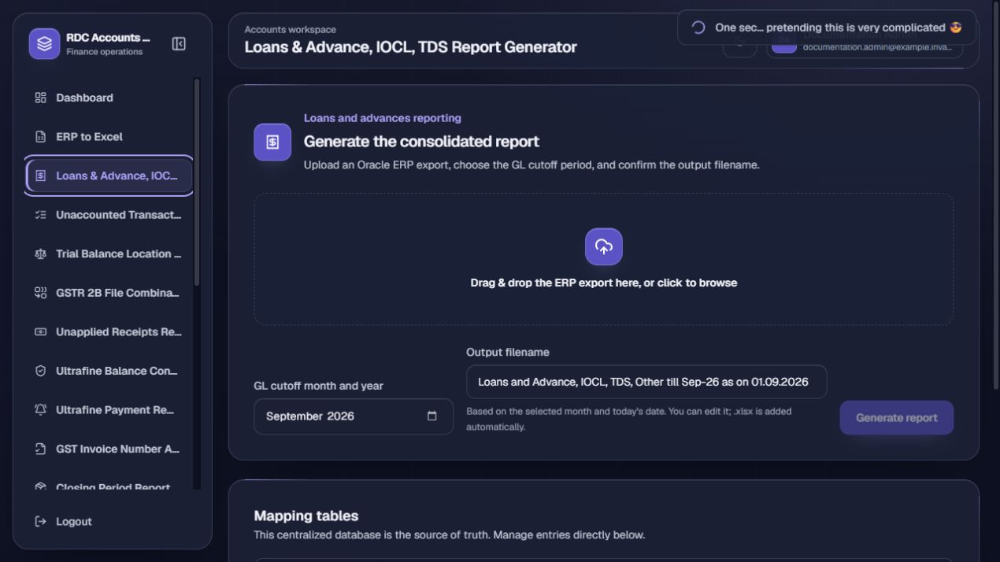
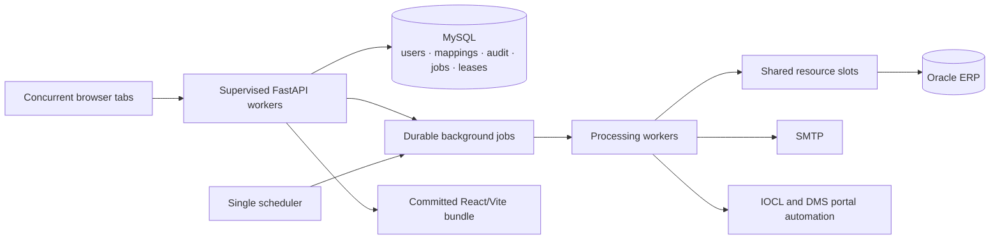

# RDC Accounts Suite

> A production-oriented finance operations workspace that consolidates RDC
> Concrete and Ultrafine reporting, reconciliation, mapping, Oracle enrichment,
> and scheduled communication workflows into one secure web application.


## At a glance

| Product surface | Engineering baseline |
| --- | --- |
| 13 permission-controlled finance applications | 200 automated backend tests |
| Centralized, searchable MySQL mappings | Multi-process API, job-worker, and scheduler runtime |
| RDC-only, Ultrafine-only, and combined dashboard views | Owner- and browser-tab-scoped durable jobs |
| Excel, Oracle ERP, SMTP, and browser-automation workflows | Soft deletion, audit history, encrypted secrets, and idempotent mail |

The suite replaces a collection of Windows utilities with one responsive,
role-aware workspace. Users receive only the tools granted to them; administrators
control access, mappings, email defaults, automation, audit history, and recovery.

## Application catalogue

| Application | Outcome | Integration |
| --- | --- | --- |
| ERP to Excel Converter | Converts raw ERP exports into clean, formatted workbooks | Excel files |
| Loans & Advance, IOCL, TDS Report Generator | Produces the mapped loans, advances, IOCL, TDS, and other report with an editable download name | Excel files |
| Unaccounted Transactions, Pending MRN & Uninvoiced Expense POs | Detects periods, generates three exception reports, previews email, and sends the selected package | Excel + SMTP |
| Trial Balance Location Wise | Converts and reviews trial-balance data by location | Excel files |
| GSTR 2B File Combinator | Validates and combines GSTR-2B exports | Excel files |
| Unapplied Receipts Report Generator | Enriches receipts with live location and comment data | Oracle ERP |
| Ultrafine Balance Confirmation | Prepares and sends customer balance confirmations | Excel + SMTP |
| Ultrafine Payment Reminder | Prepares and sends controlled payment reminders | Excel + SMTP |
| GST Invoice Number Adder | Enriches GST workbooks with invoice numbers | Oracle ERP |
| Closing Period Report Generator | Combines Oracle BI Publisher HTML-XLS exports into a formula-backed report | HTML-XLS files |
| Ultrafine IOCL Balance Monitor | Checks CCMS balance, maintains complete history, and sends scheduled morning and threshold reminders | Playwright + SMTP |
| Ultrafine Invoice Booking Tracker | Scans every page of every configured DMS work queue, keeps the latest complete tracker visible, and sends the daily tracker | Playwright + SMTP |
| Ultrafine Creditors Ageing Report Generator | Builds classified creditors, advances, and intercompany ageing schedules from Tally | Excel files |
| Ultrafine Trial Balance Formatter | Reproduces the approved Ultrafine trial-balance layout from a raw Tally export | Excel files |

The DMS Downloader is retired and intentionally excluded from the catalogue.

## Product tour

| Secure sign-in | Editable report identity |
| --- | --- |
|  |  |

| Role-aware dashboard | Searchable user administration |
| --- | --- |
|  |  |


Screenshots were captured from a disposable documentation database containing
only synthetic `example.invalid` users, recipients, and credentials.

## Finance workflow capabilities

### Reporting and workbook fidelity

- Background processing keeps large workbook jobs responsive and recoverable.
- Date, month, year, and month-year pickers replace ambiguous free-text dates.
- Formulas remain live in downloaded workbooks, with cached results populated
  where email previews or Protected View need immediately visible values.
- Pending MRN and Uninvoiced Expense PO period detection is a mandatory gate;
  neither the UI nor API accepts incomplete or stale selections.
- The loans/advances report proposes a business-ready filename from the selected
  cutoff month and current IST date, while allowing a user to edit it before download.

### Centralized reference data

- Mapping tables live in MySQL as the system of record; workbook import/export
  is intentionally removed.
- Mapping editors and missing-mapping remediation fields provide searchable
  existing-value suggestions while still accepting a new classification.
- High-growth users, mappings, exclusions, histories, and audit logs have search
  and pagination. User and audit search execute server-side.
- Seeds add missing natural keys without overwriting administrator edits or
  silently reviving archived rows.

### Automation and communications

- Email defaults, recipients, report selections, subjects, and bodies are
  centrally administered and editable only where the workflow permits.
- IOCL uses one administrator-owned sender and one shared schedule/configuration.
  Portal checks retry up to three times; threshold reminders repeat at an
  administrator-selected minute interval until the balance recovers.
- The invoice-booking tracker likewise uses one administrator-owned DMS login,
  sender, schedule, mapping set, and mail template. A scheduled mail is created
  only after every configured queue has passed full pagination validation.
- Regular users receive a safe support message for operational failures, while
  administrators retain the technical error detail in the portal and audit trail.

### Access and operational safety

- Email identity is required, normalized, and unique; first and last name are optional.
- Active/inactive state is separate from archived/not-archived state.
- Business records use soft deletion and restoration rather than destructive deletion.
- API authorization enforces application grants and administrator boundaries;
  hiding controls in the browser is never treated as security.
- SMTP/app passwords and portal sessions are encrypted and excluded from job JSON,
  logs, responses, browser storage, and source control.

## Architecture



`start_all.bat` launches the supervisor, which maintains API workers, job
workers, and one scheduler. MySQL coordinates jobs, rate limits, ownership,
leases, resource slots, and idempotent actions, so multiple users and tabs do
not depend on process-local memory. Oracle work shares the `oracle-gst` slot to
avoid multiplying connection pressure as worker counts increase.

See [Architecture](docs/ARCHITECTURE.md) for the complete concurrency and data
protection model.

## Technology stack

| Layer | Technologies |
| --- | --- |
| Frontend | React, TypeScript, Vite, Tailwind CSS, Geist, Lucide icons |
| API | FastAPI, Pydantic, SQLAlchemy |
| Durable coordination | MySQL jobs, leases, resource slots, rate limits, sessions, and audit events |
| Burst-safe request auditing | Immediate independent file trail; MySQL mirror runs after the response so bounded pools do not deadlock |
| Workbook processing | Streaming OOXML, openpyxl, pure-Python formula caching, file-format-aware parsers |
| Integrations | Oracle Database, SMTP, Playwright Chromium |
| Operations | Windows supervisor, multi-process API/workers, scheduler, committed static bundle |

## Quick start

1. Install Python 3.11+ and MySQL on the server PC.
2. Copy `backend/.env.example` to `backend/.env` and configure MySQL, the
   initial administrator, application URL, and required Oracle/SMTP values.
3. Install Oracle Instant Client under `backend/instantclient/` only when using
   Oracle-backed applications.
4. Run [`start_all.bat`](start_all.bat). It prepares dependencies, installs the
   supported Playwright browser, and starts the supervised suite on port `2805`.
5. Open `http://<server-LAN-IP>:2805` and sign in as the initial administrator.

Production does not need Node/npm because the built frontend is committed under
`backend/app/static/`.

Running `start_all.bat` again is a verified restart operation. It asks an
existing supervisor to stop cleanly, removes any orphaned suite workers, waits
for port `2805` to be free, and only then starts the replacement process tree.
An unrelated program occupying the port is reported and is never killed.

## Development and verification

```powershell
cd backend
.\venv\Scripts\python.exe -m compileall -q app tests
.\venv\Scripts\python.exe -m unittest discover -s tests -p "test_*.py"

cd ..\frontend
npm install
npm run build
```

The Vite build writes to `backend/app/static/`; commit frontend source and the
generated bundle together. The current suite contains 212 backend unit and
integration tests. Passing them verifies covered behavior but is not a claim of
complete live Oracle, SMTP, portal, or historical desktop parity.

## Documentation

| Guide | Audience |
| --- | --- |
| [User guide](docs/USER_GUIDE.md) | Uploads, report generation, downloads, mapping remediation, and IOCL history |
| [Administrator guide](docs/ADMIN_GUIDE.md) | Users, grants, centralized mappings, email defaults, IOCL automation, and audit |
| [Architecture](docs/ARCHITECTURE.md) | Runtime topology, concurrency, leases, ownership, and secret handling |
| [Deployment](docs/DEPLOYMENT.md) | Production pull, MySQL migrations, restart, and verification |
| [Troubleshooting](docs/TROUBLESHOOTING.md) | Server, job, Oracle, SMTP, and IOCL diagnostics |
| [Security policy](SECURITY.md) | Vulnerability reporting and secret-handling expectations |
| [AI agent handoff](docs/AI_CODING_AGENT_HANDOFF.md) | Product invariants, reference applications, migrations, and required checks |

## Deployment model

Production updates are explicit: pull `main`, run any applicable dated SQL from
[`deployment/mysql`](deployment/mysql) in MySQL Workbench, restart
[`start_all.bat`](start_all.bat), and perform the checks in
[the deployment guide](docs/DEPLOYMENT.md). Migrations are written to be
idempotent, but should still be reviewed before execution.

## Project status

This is an internal, proprietary operations application built for the configured
RDC/Ultrafine environment. No license is granted for external redistribution.
Desktop parity is reported only for workflows validated with representative
inputs and the required external systems.

## Contributing

Read [`AGENTS.md`](AGENTS.md), [`CONTRIBUTING.md`](CONTRIBUTING.md), and
[`docs/AI_CODING_AGENT_HANDOFF.md`](docs/AI_CODING_AGENT_HANDOFF.md) before
changing code. They define non-negotiable product invariants, the deployment
boundary, test commands, and safe collaboration rules.
